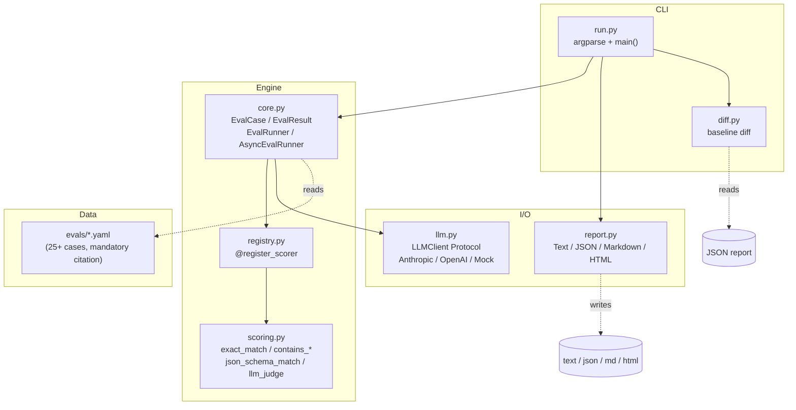
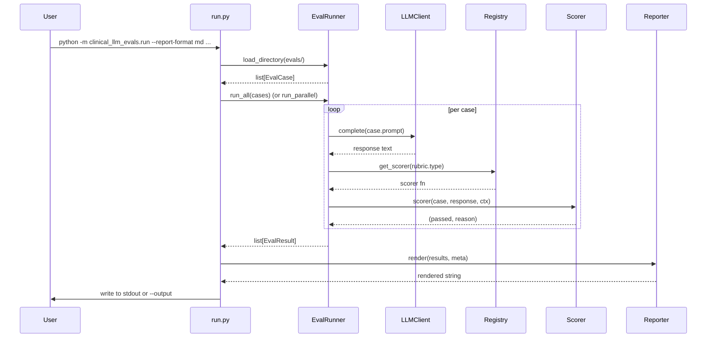

# Architecture

`clinical-llm-evals` is a small, deliberately boring evaluation harness.
The non-negotiable design constraint is **every test case cites a real
clinical source**; everything else (CLI, reporters, scoring strategies)
should stay out of the contributor's way.

## Module dependency diagram

## Request flow

## Why this shape

- **Registry pattern** (inspired by `openai/evals` and
  `lm-evaluation-harness`): adding a new scoring strategy is a single
  `@register_scorer("my_type")` decorator. No editing of `_score`
  dispatch tables. Custom scorers live in the user's own module.
- **Reporter strategy** (inspired by pytest's plugin system and
  `inspect_ai`'s log viewer): rendering is separated from running, so a
  failing test only changes one place; output formats compose.
- **Sync default, async opt-in**: most LLM SDKs are sync, and threads
  are the right tool for IO-bound work. `AsyncEvalRunner` is provided
  for users wiring an HTTPX/aiohttp client directly.
- **JSON as a contract**: the JSON report is the only stable cross-run
  artifact. `diff.py` consumes it; CI artifacts archive it; future
  dashboards read it.
- **Mandatory citations**: enforced at schema-validation time
  (`tests/test_eval_schema.py`). Without this, the suite is just
  another MedQA derivative.

## Module size budget (rough, current)

| Module | Lines | Stable? |
|---|---|---|
| `core.py` | ~300 | yes |
| `scoring.py` | ~250 | yes |
| `registry.py` | ~150 | yes |
| `report.py` | ~400 | yes |
| `diff.py` | ~200 | yes |
| `run.py` | ~250 | yes |
| `llm.py` | ~300 | yes (extension points only) |

The goal is that any single module fits in your head in under five
minutes. If a module is creeping over ~400 lines, it probably wants to
be split.

## Adding things

| You want to... | Add it here | Hard requirement |
|---|---|---|
| A new scoring strategy | Your own module, with `@register_scorer("name")` | Function returns `(bool, str)` |
| A new model adapter | New class in `llm.py` (or your own module) | Has `.complete(prompt) -> str` |
| A new report format | New class in `report.py`, register in `_REPORTERS` | `.render(results, meta) -> str` |
| A new eval case | A YAML file under `evals/<category>/` | **Cite a real source** |
| An async adapter | Implement `AsyncLLMClient` Protocol in your own module | `async def complete(prompt) -> str` |
